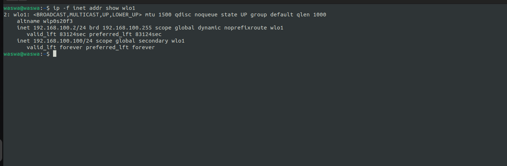

[](https://snapcraft.io/failover)


$\text{\color{red}Major performance issues currently being dealt with}$

# Failover

## Installation via snap
Failover is a VRRP implementation currently configured for debian instances.

To install failover, run the following command:

```bash
snap install failover
```
with this, we should see failover when we run the `snap list` command.


When failover is installed, it automatically starts a systemd service that can be viewed via systemstl. 
When we `sudo systemctl status snap.failover.main.service`, we should see:


That indicates that Failover is running as a daemon in on our system. 


### Config 
The following are the configurations that can be made on a <u>Failover</u> Virtual Router:

    - *name 
    - *Virtual Router ID
    - *Ip Addresses 
    - *Interface Name
    - Priority (default - 100)
    - Advertisement Interval ( default - 1)
    - Preempt Mode[true/false] ( default - true )

    * Compulsory fields.  

When installed via snap, Failover fetches configurations from /`snap/failover/bin/vrrp-config.json` file by default. 

**Make sure to change the fields in this `/snap/failover/bin/vrrp-config.json` file to suite your personal environment**


### File config
The following is a sample of how our vrrp-config.json file will look like:

```json
{
    "name": "VR_1",
    "vrid": 51,
    "interface_name": "wlo1",
    "ip_addresses": [ 
        "192.168.100.100/24"
    ],
    "priority": 10,
    "advert_interval": 1,
    "preempt_mode": true
}
```

For each of the ip addresses specified in the `ip_addresses` field, if we are MASTER in the VRRP process we take part in, the ip address(es) will be added to the interface specified in the `interface_name` field.

For example, in the JSON file above, we have a single IP address (192.168.100.100/24). This will be how the address will look for `wlo1`:



*This address will automatically be deleted once the Failover service is stopped.*

More documentation is still being worked on.
Will be ready to view [here](https://failover-docs.readthedocs.io/en/latest/). 