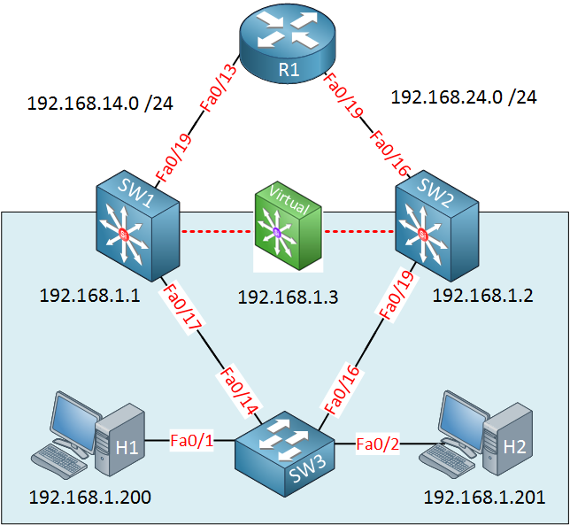
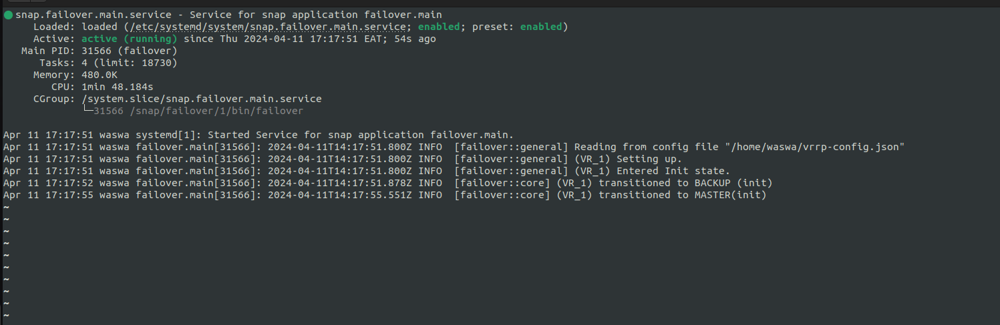

[](https://snapcraft.io/failover)

# Failover

Failover is a VRRP(version 2) implementation currently configured for Ubuntu(soon introducing other Linux and windows systems).

VRRP is a Router redundancy protocol that has been specified under [RFC 3768](https://datatracker.ietf.org/doc/html/rfc3768). It works by creating a "virtual router" with virtual addresses. Since the virtual router is an abstract concept, we can have any of the physical devices be this "virtual router". 

When a user configures the virutal router for a task (e.g a gateway) and the router that is the MASTER of the Virtual router goes down and a BACKUP router takes over, the end user will not notice a thing since the virtual router will still be operational. 

The following image from [Network Lessons](https://networklessons.com/cisco/ccie-routing-switching/vrrp-virtual-router-redundancy-protocol) illustrates this:




Whichever between 192.168.1.1 or 192.168.1.2 is MASTER of the virtual router(192.168.1.3), the end users(192.168.1.200 and 192.168.1.201) will not notice when one goes down and the other takes over. 

This library implements the above. Also, these same concepts can be transferred from Routers to Servers where redundancy is needed. 

## Installation via snap

To install failover, run the following command:

```sh
snap install failover --devmode --edge
```
with this, we should see failover when we run the `snap list` command.

*Due to restrictions from the snap store, we can only run --edge and --beta*

When failover is installed, it automatically starts a systemd service that can be viewed via systemstl. 
When we `sudo systemctl status snap.failover.main.service`, we should see:



That indicates that Failover is running as a daemon in on our system. 

If there is a problem with the running of Failover, view the logs with the following command:
```sh
journalctl -xeu snap.failover.setup.service
```

Also, feel free to raise an [issue](https://github.com/Paul-weqe/failover/issues) in case of anything.  

When installed via snap, Failover fetches configurations from `/var/snap/failover/common/vrrp-config.json` file by default. The configurations 

**Make sure to change the fields in this `/var/snap/failover/common/vrrp-config.json` file to suite your personal environment. Sample configs are shown on [sample config](https://github.com/Paul-weqe/failover/blob/main/sample-vrrp-config.json).**


## Running Failover from local build. 

Failover can also be built and run manually via cargo. To install cargo, follow [this guide](https://doc.rust-lang.org/cargo/getting-started/index.html).

You can run the project using the command:
```sh
cargo run --bin failover
```

Since VRRP creates virtual IP addresses on one of our system's interfaces, we should do a teardown to remove the IP addresses from the system once Failover is done running:
```sh
cargo run --bin failover --teardown
```

To simplify the two commands above, we can run: 

```sh
./run
```

When running from a local build, by default the `/etc/failover/vrrp-config.json` file will be used as our configuration file. Take [this](https://github.com/Paul-weqe/failover/blob/main/sample-vrrp-config.json) as a sample of how your JSON config file should look like. 


<b><u>Config</u></b>

The following are the items that can be configured on <u>Failover</u>:

    - *name (string): The name of the virtual router instance.  

    - *Virtual Router ID (int): VRID of the instance you are running. Range is 1-255
    
    - *Ip Addresses (list[string]): Virtual IP addresses that will be carried by these routers
    
    - *Interface Name (string): name of the network interface that the Virtual Router will run on.
    
    - Priority (int)[default -> 100]: Priority of this Virtual Router instance. The highest priority will be chosen as the master for the VRRP group. 
    
    - Advertisement Interval (int)[default -> 1]: Periodic Advertisements are sent from the master to BACKUP devices, this sets the duration between each advertisement(in seconds). 
    
    - Preempt Mode(bool)[default -> true]: When true, a higher priority backup router will preempt a lower priority Master. 
    

    * COMPULSORY FIELDS.  


$\text{\color{red}More documentation is still being worked on.}$

Documentation will be ready to view in due time [here](https://failover-docs.readthedocs.io/en/latest/). 